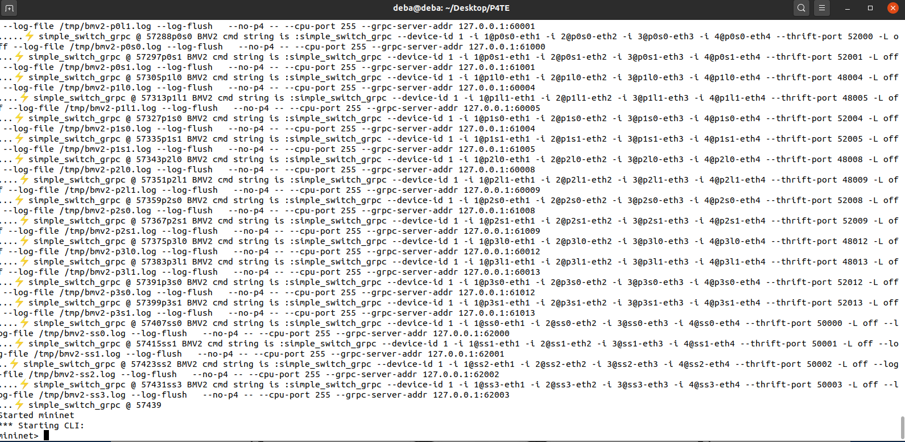
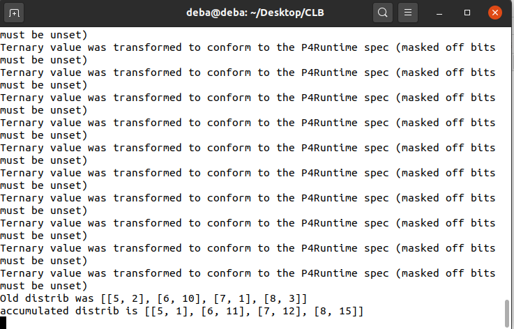

# How to setup the environment
    . Go to jfingerhut's github repository of P4-guide. (https://github.com/jafingerhut/p4-guide)
    . Use the install script you want to use appropriate for your distribution.
    . We have used the Ubuntu 20.04 version (https://github.com/jafingerhut/p4-guide/blob/master/bin/install-p4dev-v4.sh)

# # Now download the github repository for this project
    . Link : https://github.com/drobinkent/Top-K-Path

# All the necessary libraries should be already installed in the system by now

    

# How this system works (Main configuration file for this project is "./ConfigConst.py" (All the file and folder path described in this doc are relative to the project directory)

# Configuring the Mininet based topology
    1) This system at first starts a fat-tree topology using mininet. 
    2) All the switches are bmv2 P4 software switch. So in the environemnt setup stage all the dependency should be installed in your machine
    3) Fat-tree topology needs to provide the maximum number of ports in a switch. And P4TE assumes that , there will be a common IP prefix for the whole DCN
    4) You need to configure 3 information in the file "MininetSimulator/ClosConstants.py"
        a) CLOS_MAX_PORT_NUMBER = 4 -- Here 4 is the maximum number of ports in the switches. You can use any even number for your network 4,8,16 etc
        b) DCN_CORE_IPv6_PREFIX = "2001:1:1:1:0:" -- Here the IPv6 prefix for the DCN is "2001:1:1:1:0:" you can use your own Ipv6 prefix. The system will allocate IPv^ addresses for the hists and switches it's ownself
        c) lastly you need to allocate IPv6 ports range for various use of the system 
            LEAF_SWITCH_GRPC_PORT_START = 60000 # 50000+i
            SPINE_SWITCH_GRPC_PORT_START = 61000 # 50500+i
            SUPER_SPINE_SWITCH_GRPC_PORT_START = 62000 # 50500+i
            CPU_PORT = 255 # we hope that we will never use 256 port of a device
            
            
            LEAF_SWITCH_THRIFT_PORT_START = 48000 # 50000+i
            SPINE_SWITCH_THRIFT_PORT_START = 52000 # 50500+i
            SUPER_SPINE_SWITCH_THRIFT_PORT_START = 50000 # 50500+i
            
            Each switch needs grpc and thrift port for various control plane communication. So in your machine either these mentioned port range should be free.
            Or you  have to allocate port range acoording to your machine

# Running the Mininet Topology
    1) after you have completed your desired configuration for the mininet emulator part, now it's time to run the emulator
    2) open a terminal and change the directory to project folder
    3) The folder contains a MAkefile 
    4) Just run the command "make start_clos" -- this command will start the clos (fat-tree topology)
    5) If everything is okay you should see an output like folllowing and that means the simulator have started. 

# Intermediate Information
    1) Once the mininet simulator have started, all the informations regarding the topology is writtem to an intermediate file and it is used 
        frequently in various places. This is defined as "MininetSimulator/Build/Internalnetcfg.json". Do not change it

# Running the Tests: This involves 3 steps
    a) Data plane configurations 
    b) Control plane configurations 
    c) Starting the flow with necessary configurations

# How to test P4KP

## Data plane configurations
Assume you want to store 16 paths in each rank and you will store 16 ranks.
In out proof of concept implementation we have stored K ranks and K paths for each rank. 
go to the makefile and 
look at the follwoing rules "p4-leaf-top-k-path" and "p4-spine-top-k-path". 
In these 2 rules there is a compile time variable "-DK=16". If you want to use different value for K, change it here.

## Control plane configurations
in the **ConfigConst.py** set K=16 -- same value as you have configured in the data plane. 

## Starting the flow with necessary configurations

At first look at the evaluation section of the paper. 
Now we need to provide configurations to emulate the monitoring behavior. 

Open the file **DistributedAlgorithms/Testingconst.py**. Look at the follwoing variable 

    #Format [delay when the config will be updated, [(port, rank, portRate, port BufferSize)]]
    TOP_K_PATH_EXPERIMENT_PORT_RATE_CONFIGS = [(.5, [(5, 0, 6, 20), (6, 2, 10, 8), (7, 2, 0, 8), (8, 4, 4, 20) ]),
    (.5, [(7, 0, 6, 20), (5, 2, 10, 8), (8, 2, 0, 8), (6, 4, 4, 20) ]),
    (.5, [(7, 0, 6, 20), (5, 2, 10, 8), (6, 2, 0, 8), (8, 4, 4, 20) ]),
    (.5, [(6, 0, 6, 20), (5, 2, 10, 8), (8, 2, 0, 8), (7, 4, 4, 20) ]),
    (.5, [(5, 0, 6, 20), (6, 2, 10, 8), (7, 2, 0, 8), (8, 4, 4, 20) ]),
    (.5, [(7, 0, 6, 20), (5, 2, 10, 8), (8, 2, 0, 8), (6, 4, 4, 20) ]),
    (.5, [(7, 0, 6, 20), (5, 2, 10, 8), (6, 2, 0, 8), (8, 4, 4, 20) ]),
    (.5, [(6, 0, 6, 20), (5, 2, 10, 8), (8, 2, 0, 8), (7, 4, 4, 20) ])
    ]

This means after every 0.5 seconds all the 4 paths of the switch (the switch that is using the top-k-path system)
will be updated with different capacity. this effectively simulates a monitoring module, that gives feedback about 
each of the 4 paths. the port having portRate 0 implies the port is currently down.

# Running the test

Steps

    a) starting mininet : discussed earlier in the file. look at top
    b) for starting the controller : open another terminal and run **make start_ctrlr** This will start the control plane and it 
        will start installing paths according to their ranks given in TOP_K_PATH_EXPERIMENT_PORT_RATE_CONFIGS variable. 

        You should see a output similar to this picture. This means your controller has started correctly.

    c) open a terminal window and go inside the directory where you have copied the Top-K-path github repo. run the follwoing command

        $  python3 TestCaseDeployer.py  /home/deba/Desktop/Top-K-Path/testAndMeasurement/TestConfigs/TopKPathTesterWithTopKPath.json
    
    This will start 3 flows as described in the paper.

# Analyzing the result

Ther IPerf results are saved in  **testAndMeasurement/TEST_RESULTS** folder

check the flow completion time from those results

------------------------------ END-----------------------

    
